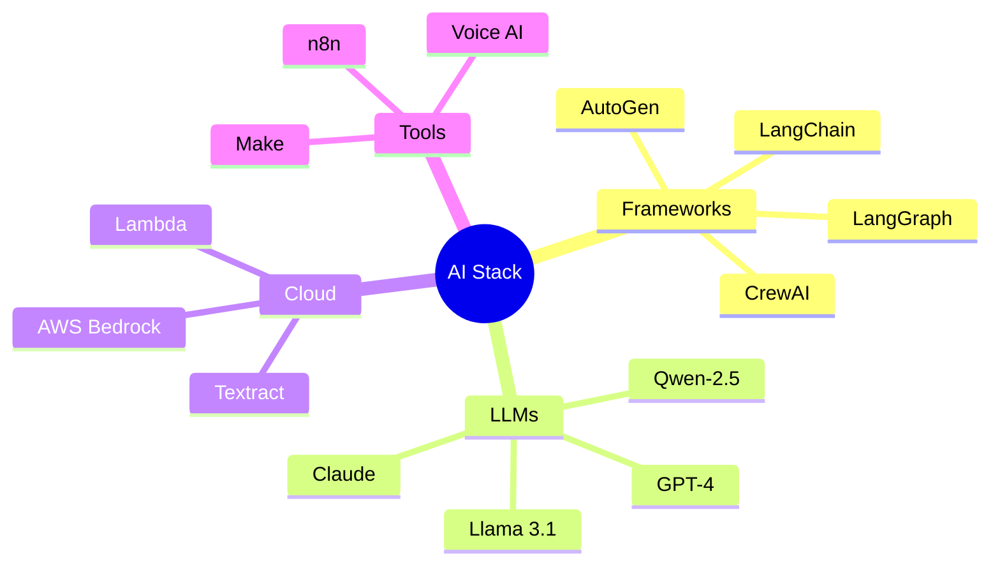

# 👨‍💻 Muhammed Ehab

### AI Specialist Engineer | Multi-Agent Systems Architect | Automation Expert

📍 **Tunis, Tunisia** | 🏠 **Remote Work** | 🌍 **AI Specialist Engineer**

---

## 🚀 About Me

<table>
<tr>
<td width="60%">

### 👨‍💻 Who I Am

Experienced **AI Specialist Engineer** with a proven track record in building **intelligent systems**, **multi-agent architectures**, and **enterprise automation solutions**. I specialize in leveraging cutting-edge AI technologies to create production-ready applications that solve complex real-world problems.

### 🎯 What I Do

- 🔭 **Building** production-ready multi-agent systems and RAG architectures
- 🌱 **Learning** advanced prompt engineering, LLM optimization, and distributed AI systems
- 💼 **Open to** collaboration on AI projects, consulting, and freelance opportunities
- 🎯 **Mission** making AI accessible and practical for businesses worldwide

</td>
<td width="40%">

### 🛠️ Quick Stack Overview

</td>
</tr>
</table>

### 💡 Expertise Areas

---

## 🛠️ Technology Stack

### 🤖 AI & Machine Learning

**Frameworks & Libraries:**
- **LangChain** | **LangGraph** | **LlamaIndex** - LLM orchestration and RAG
- **CrewAI** | **AutoGen** - Multi-agent systems
- **PEFT** | **LoRA** | **QLoRA** - Efficient fine-tuning
- **Transformers** | **Sentence-Transformers** - NLP models
- **FAISS** | **ChromaDB** | **Pinecone** - Vector databases
- **Gradio** | **Streamlit** - AI app interfaces

### ☁️ Cloud & Infrastructure

**Services:**
- **AWS Bedrock** - Claude, Llama, Mistral deployment
- **Amazon Textract** - Document intelligence
- **Amazon Comprehend** - NLP services
- **AWS Lambda** - Serverless computing
- **S3** | **EC2** | **SageMaker**

### 🔄 Automation & Integration

**Platforms:**
- **n8n** - Workflow automation (Expert level)
- **Make** | **Zapier** - Integration platforms
- **REST APIs** | **GraphQL** - API development
- **Webhooks** | **Event-driven architecture**

### 🗣️ Voice & Speech AI

**Technologies:**
- **OpenAI Whisper** - Speech-to-Text
- **ElevenLabs** | **Azure TTS** - Text-to-Speech
- **Deepgram** | **AssemblyAI** - Real-time transcription
- **Rasa** | **Dialogflow** - Conversational AI

### 📱 Mobile & Web Development

### 🗄️ Databases & Data Processing

### 🧪 LLM Models Experience

**Models:**
- **GPT-4** | **GPT-4 Turbo** | **GPT-3.5**
- **Claude 3.5 Sonnet** | **Claude 3 Opus**
- **Llama 3.1 (8B, 70B, 405B)**
- **Qwen-2.5** | **FLAN-T5** | **Mistral 7B**
- **Gemini Pro** | **PaLM 2**

---

## 📊 GitHub Statistics

---

## 🏆 Featured Projects

### 🤖 Multi-Agent Systems & AI Orchestration

<table>
<tr>
<td width="50%">

#### [BTP Multi-Agent Construction Management](https://github.com/muhammedehab35/BTP-Multi-Agent-Construction-Management-System)
Advanced multi-agent system for construction project management with autonomous task coordination and decision-making capabilities.

**Tech:** Python, CrewAI, LangChain, AWS
⭐ Stars: 2 | 📝 MIT License

</td>
<td width="50%">

#### [MCP AI Chat Interface](https://github.com/muhammedehab35/MCP-AI-Chat-Interface)
Model Context Protocol implementation for seamless AI chat interactions with advanced context management.

**Tech:** Python, MCP, FastAPI
⭐ Stars: 2 | 📝 MIT License

</td>
</tr>

<tr>
<td width="50%">

#### [Finance Agent](https://github.com/muhammedehab35/FINANCE_AGENT)
Intelligent financial analysis assistant with real-time data processing and autonomous decision support.

**Tech:** Python, LangChain, APIs
⭐ Stars: 5

</td>
<td width="50%">

#### [Lead Qualification Scoring System](https://github.com/muhammedehab35/Lead-Qualification-Scoring-System-n8n_Agent)
Automated lead scoring system using n8n workflow automation and AI-powered analysis.

**Tech:** HTML, n8n, AI APIs
⭐ Stars: 2

</td>
</tr>
</table>

### 📄 RAG & Document Intelligence

<table>
<tr>
<td width="50%">

#### [SmartDoc AI Assistant](https://github.com/muhammedehab35/SmartDoc-AI-Assistant)
Enterprise-grade document analysis system with RAG capabilities and intelligent Q&A.

**Tech:** Python, LangChain, Vector DB
📝 MIT License

</td>
<td width="50%">

#### [VisionExtract AI](https://github.com/muhammedehab35/VisionExtract-AI-Advanced-Document-Data-Extraction-using-Fine-tuned-Qwen-2.5-7B)
Advanced document extraction using fine-tuned Qwen-2.5-7B with vision capabilities.

**Tech:** Python, Qwen, Fine-tuning
⭐ Stars: 7

</td>
</tr>

<tr>
<td width="50%">

#### [Scalable RAG with AWS Bedrock](https://github.com/muhammedehab35/Scalable-RAG-Solution-with-AWS-Bedrock-Integration)
Production-ready RAG system leveraging AWS Bedrock for enterprise deployment.

**Tech:** Python, AWS Bedrock, S3
⭐ Stars: 7 | 📝 MIT License

</td>
<td width="50%">

#### [Document Analysis AI Agent](https://github.com/muhammedehab35/Document-Analysis-AI-Agent-with-AWS)
Cloud-based document intelligence using AWS Textract and AI analysis.

**Tech:** Python, AWS Textract, Lambda

</td>
</tr>
</table>

### 🗣️ Voice AI & Speech Systems

<table>
<tr>
<td width="50%">

#### [Real-Time Speech-to-Speech](https://github.com/muhammedehab35/REAL-TIME-SPEECH-TO-SPEECH-BY-OLLAMA-MODELS)
Low-latency voice communication system using Ollama models for real-time translation.

**Tech:** Python, Ollama, Whisper
⭐ Stars: 1 | 📝 MIT License

</td>
<td width="50%">

#### [AI Voice Assistant](https://github.com/muhammedehab35/AI-VOICE-ASSISTANT-BY-OPEN-SOURCE-LLM)
Open-source voice assistant with natural conversation capabilities.

**Tech:** Python, Open-source LLMs
⭐ Stars: 1 | 📝 MIT License

</td>
</tr>

<tr>
<td width="50%">

#### [Android AI Assistant (n8n)](https://github.com/muhammedehab35/ANDROID-AI-ASSISTANT-BY-N8N)
Mobile AI assistant integrated with n8n for workflow automation.

**Tech:** Dart, Flutter, n8n
⭐ Stars: 1 | 🔄 Forks: 1

</td>
<td width="50%">

#### [Interior Design Voice AI](https://github.com/muhammedehab35/Interior-Design-Voice-AI-Agent)
Specialized voice agent for interior design consultations and recommendations.

**Tech:** Python, Voice AI
📝 MIT License

</td>
</tr>
</table>

### 🔧 Tools, Integrations & Infrastructure

<table>
<tr>
<td width="50%">

#### [DB MCP Gateway](https://github.com/muhammedehab35/DB_MCP_GATEWAY)
Database integration gateway using Model Context Protocol for seamless data access.

**Tech:** TypeScript, MCP
⭐ Stars: 1 | 📝 MIT License

</td>
<td width="50%">

#### [JSON2TOON MCP](https://github.com/muhammedehab35/JSON2TOON-MCP)
Converts JSON data structures into visual cartoons and diagrams.

**Tech:** Python, Visualization
⭐ Stars: 2 | 📝 MIT License

</td>
</tr>

<tr>
<td width="50%">

#### [n8n CRM Connector (Teamleader)](https://github.com/muhammedehab35/n8n-CRM-Connector-for-Teamleader)
Custom n8n node for Teamleader CRM integration with advanced features.

**Tech:** TypeScript, n8n
📝 MIT License

</td>
<td width="50%">

#### [AI Translator](https://github.com/muhammedehab35/AI_TRANSLATOR)
Multi-language translation system powered by AI with context awareness.

**Tech:** Python, Translation APIs
⭐ Stars: 1

</td>
</tr>
</table>

### 🧠 LLM Fine-tuning & Training

<table>
<tr>
<td width="50%">

#### [FLAN-T5 Fine-tuning (PEFT)](https://github.com/muhammedehab35/fine-tun-FLAN-T5-for-text-summarisation-task-using-PEFT-approach.)
Efficient fine-tuning of FLAN-T5 for text summarization using PEFT approach.

**Tech:** Jupyter, PEFT, LoRA
⭐ Stars: 2 | 📝 MIT License

</td>
<td width="50%">

#### [AWS Bedrock + Llama 3.1 405B](https://github.com/muhammedehab35/AWS-Bedrock-Service-Implementation-using-Llama-3.1-405B)
Large-scale LLM deployment using AWS Bedrock infrastructure.

**Tech:** Python, AWS Bedrock
📝 MIT License

</td>
</tr>
</table>

### 🎓 Education & Specialized Apps

<table>
<tr>
<td width="50%">

#### [CourseGenius](https://github.com/muhammedehab35/CourseGenius)
AI-powered platform for automated course creation and curriculum design.

**Tech:** JavaScript, AI APIs
⭐ Stars: 7

</td>
<td width="50%">

#### [Prompt Engineering Projects](https://github.com/muhammedehab35/PROMPT_ENGINEERING_PROJECTS)
Collection of advanced prompt engineering techniques and experiments.

**Tech:** Various
⭐ Stars: 1

</td>
</tr>

<tr>
<td width="50%">

#### [Diag Health Agent](https://github.com/muhammedehab35/DIAG_HEALTH_AGENT)
Medical diagnostic assistant using AI for preliminary health assessments.

**Tech:** Python, Medical NLP
⭐ Stars: 3

</td>
<td width="50%">

#### [Tunisia License Plate Recognition](https://github.com/muhammedehab35/TUNUSIA_LICENSE_PLATE-RECOGNITION)
Computer vision system for Tunisian license plate detection and recognition.

**Tech:** Python, OpenCV, YOLO
⭐ Stars: 1 | 📝 MIT License

</td>
</tr>
</table>

---

## 🎯 Core Competencies

<table>
<tr>
<td width="33%" valign="top">

### 🤖 AI & Machine Learning
- Multi-Agent Systems (CrewAI, AutoGen)
- Large Language Models (GPT-4, Claude, Llama)
- RAG Architecture & Vector Databases
- Fine-tuning & PEFT (LoRA, QLoRA)
- Prompt Engineering
- Computer Vision (OCR, Object Detection)
- NLP & Text Processing

</td>
<td width="33%" valign="top">

### ☁️ Cloud & DevOps
- AWS Bedrock & AI Services
- Amazon Textract & Comprehend
- AWS Lambda & Serverless
- S3, EC2, SageMaker
- Docker & Containerization
- CI/CD Pipelines
- Microservices Architecture

</td>
<td width="33%" valign="top">

### 🔄 Automation & Integration
- n8n Workflow Automation
- API Development & Integration
- Event-Driven Architecture
- Webhook Management
- Custom Node Development
- Process Automation
- System Integration

</td>
</tr>
</table>

---

## 📈 Contribution Activity

---

## 💼 Professional Services

<table>
<tr>
<td align="center" width="33%">

### 🎯 AI Solution Architecture
Design and implement enterprise AI systems with scalable architecture

**Services Include:**
- System Design & Planning
- Technology Stack Selection
- Performance Optimization
- Security Implementation

</td>

<td align="center" width="33%">

### 🤖 Multi-Agent Development
Build autonomous agent systems for complex workflows

**Services Include:**
- Agent System Design
- Workflow Orchestration
- Task Automation
- Integration Development

</td>

<td align="center" width="33%">

### ☁️ AWS Bedrock Integration
Cloud AI deployment and scaling solutions

**Services Include:**
- Bedrock Setup & Config
- Model Deployment
- Cost Optimization
- Performance Tuning

</td>
</tr>

<tr>
<td align="center" width="33%">

### 📊 RAG Implementation
Create scalable retrieval-augmented generation systems

**Services Include:**
- Vector DB Setup
- Embedding Optimization
- Query Enhancement
- System Integration

</td>

<td align="center" width="33%">

### 🔄 Automation Consulting
n8n workflow design and optimization

**Services Include:**
- Workflow Design
- Custom Node Development
- API Integration
- Process Optimization

</td>

<td align="center" width="33%">

### 🗣️ Voice AI Development
Speech-to-speech and conversational AI systems

**Services Include:**
- Voice Interface Design
- Real-time Processing
- TTS/STT Integration
- Multi-language Support

</td>
</tr>
</table>

### 📞 Let's Work Together

---

## 📫 Connect With Me

---

## 💡 Current Focus Areas

<table>
<tr>
<td align="center" width="25%">

### 📚 Learning
- Advanced Multi-Agent Architectures
- Enterprise RAG Systems
- LLM Optimization
- Distributed AI
</td>

<td align="center" width="25%">

### 🚀 Building
- Production AI Agents
- Scalable RAG Solutions
- Voice Applications
- n8n Integrations
</td>

<td align="center" width="25%">

### 🔍 Exploring
- Anthropic Claude API
- LangGraph Workflows
- AWS Bedrock Features
- Real-time AI Apps
</td>

<td align="center" width="25%">

### 💻 Contributing
- Open-Source AI Tools
- Community Projects
- Documentation
- Code Reviews
</td>
</tr>
</table>

### 🎯 2026 Goals

 **75%** - Multi-Agent Systems Mastery

 **60%** - AWS Solutions Architect Certification

 **85%** - Production RAG Implementations

 **50%** - Open Source Contributions

---

## 📝 Latest Blog Posts & Articles

<!-- BLOG-POST-LIST:START -->
- Coming soon: Articles on AI engineering, multi-agent systems, and automation
<!-- BLOG-POST-LIST:END -->

---

## 🎓 Certifications & Training

- ✅ AWS Certified Solutions Architect (In Progress)
- ✅ Advanced Prompt Engineering Specialization
- ✅ LangChain & LLM Applications
- ✅ Multi-Agent Systems Development
- ✅ n8n Certified Expert

---

### 💬 "Building the future of AI, one agent at a time"

**⭐️ If you find my work valuable, consider starring some repositories!**

---

*Last Updated: January 2026*

